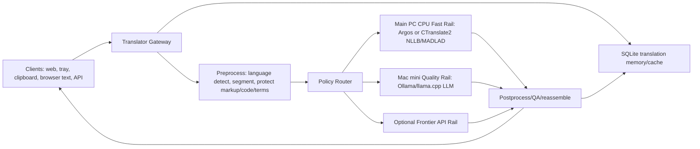

# Local/Remote Hybrid Translator Architecture v0

Date: 2026-06-22

## Goal

Build a general-purpose text translator that can replace day-to-day Google Translate usage while keeping operating cost low and avoiding the main PC dGPU during AAA games.

OCR is intentionally out of scope for the first phase. The first product surface should accept plain text, clipboard text, selected browser text, and API calls.

## Constraints

- Main PC: Ryzen 7 7800X3D. Use CPU conservatively; avoid dGPU while gaming.
- Mac mini: already stabilized as a 24/7 server. Treat it as the quality worker.
- Local first: cache, glossary, language detection, segmentation, and fast NMT should work without external APIs.
- Quality target: as close as practical to frontier LLM translation, with optional paid fallback only when explicitly routed.
- Reuse existing projects, models, and engines instead of building a translation engine from scratch.

## Candidate Summary

### Strong candidates

1. CTranslate2
   - Role: main fast local inference runtime for NMT models.
   - Why: optimized CPU/GPU transformer inference, quantization, batching, async execution, supports NLLB, M2M-100, OPUS-MT, MADLAD-400, T5, and several decoder-only LLM families.
   - Fit: excellent for CPU/iGPU-friendly "instant" translation and background-safe operation.
   - Source: https://github.com/OpenNMT/CTranslate2

2. NLLB-200 distilled 600M / 1.3B
   - Role: first serious multilingual NMT baseline.
   - Why: broad language coverage, simple sentence translation, strong enough to serve as draft translation.
   - Caveat: research/non-production model card, CC-BY-NC, input length caveats, not ideal for document translation without segmentation.
   - Sources:
     - https://huggingface.co/facebook/nllb-200-distilled-600M
     - https://huggingface.co/facebook/nllb-200-distilled-1.3B

3. MADLAD-400-3B-MT
   - Role: quality-oriented local NMT candidate, especially when broad language coverage matters.
   - Why: Apache 2.0, 400+ language model family, GGUF/quantized variants exist.
   - Caveat: heavier than NLLB 600M/1.3B; must benchmark on the actual Mac mini and main PC CPU.
   - Source: https://huggingface.co/google/madlad400-3b-mt

4. Ollama or llama.cpp on Mac mini
   - Role: 24/7 LLM translation/post-edit worker.
   - Why: easy local model serving, REST API, strong Apple Silicon path through Metal/llama.cpp.
   - Use: direct LLM translation for quality mode, or NMT draft plus LLM post-edit.
   - Sources:
     - https://github.com/ollama/ollama
     - https://github.com/ggml-org/llama.cpp

5. Qwen3 family
   - Role: general multilingual LLM quality rail.
   - Why: official open-weight dense/MoE sizes, Apache 2.0, 119 languages/dialects including Korean and Japanese, works with Ollama/llama.cpp/MLX.
   - Suggested benchmark set:
     - Mac mini 16 GB: Qwen3 8B Q4 first
     - Mac mini 32 GB: Qwen3 14B Q4/Q5
     - Mac mini 64 GB+: Qwen3 30B-A3B Q4
   - Source: https://qwenlm.github.io/blog/qwen3/

6. TowerInstruct-7B-v0.2
   - Role: translation-specialized LLM comparison target, especially EN/KO and terminology-aware translation.
   - Why: trained for translation, post-editing, context-aware and terminology-aware tasks; supports Korean.
   - Caveat: CC-BY-NC-4.0 and Llama 2 license constraints, so useful for personal/non-commercial benchmarking but not a clean default if distribution/commercial use matters.
   - Source: https://huggingface.co/Unbabel/TowerInstruct-7B-v0.2

7. Argos Translate
   - Role: very fast MVP/offline fallback and model package manager.
   - Why: simple Python library/CLI/GUI, offline, MIT, supports Korean among many languages.
   - Caveat: quality will not reach Google/DeepL/frontier LLM level alone.
   - Source: https://github.com/argosopentech/argos-translate

### Useful but not primary

1. LibreTranslate
   - Role: reference API/UI or quick self-hosted demo.
   - Why: self-hosted offline translation API powered by Argos.
   - Caveat: AGPL-3.0 if embedded or redistributed; quality ceiling is Argos.
   - Source: https://github.com/LibreTranslate/LibreTranslate

2. SeamlessM4T v2
   - Role: later multimodal/speech expansion.
   - Why: high-quality speech/text translation across nearly 100 languages.
   - Caveat: OCR is excluded and speech is not phase 1; the 2.3B model is heavy for a text-only MVP.
   - Source: https://huggingface.co/facebook/seamless-m4t-v2-large

3. Bergamot / Firefox Translations
   - Role: reference for browser-local translation and WASM architecture.
   - Why: client-side browser translation heritage.
   - Caveat: Firefox extension repo is archived and production language list was limited; not enough as the core Google Translate replacement.
   - Sources:
     - https://github.com/mozilla/firefox-translations
     - https://github.com/browsermt/bergamot-translator

4. LiteLLM
   - Role: optional external/frontier API gateway.
   - Why: unified API, provider switching, virtual keys, cost tracking.
   - Caveat: unnecessary until we enable multiple cloud fallback providers.
   - Source: https://github.com/BerriAI/litellm

5. TranslateGemma
   - Role: watchlist and benchmark candidate if weights/tooling are practical.
   - Why: 2026 technical report describes Gemma 3-based open translation models with WMT24++/WMT25 gains.
   - Caveat: verify actual available checkpoints, licenses, and runtime support before committing.
   - Source: https://arxiv.org/abs/2601.09012

## Recommended Architecture



### Main PC responsibilities

- Gateway API and local UI.
- Clipboard/hotkey/browser text integration.
- SQLite cache and glossary.
- Language detection and segmentation.
- Fast NMT on CPU only, with thread caps and low process priority.
- Never use NVIDIA/AMD dGPU in "game mode".

Suggested default caps:

- `game_mode=true`: 2-4 CPU threads, no GPU, batch small, quality requests routed to Mac.
- `normal_mode`: 4-8 CPU threads for CTranslate2, still no dGPU by default.

### Mac mini responsibilities

- 24/7 quality worker behind LAN/Tailscale.
- Ollama or llama.cpp server with OpenAI-like chat endpoint.
- LLM direct translation and LLM post-editing of NMT draft.
- Optional heavier CTranslate2/MADLAD/NLLB service if Mac CPU/Metal performs better.
- Health endpoint and launchd service for auto-restart.

### Optional cloud responsibilities

- Manual "best quality" mode.
- Automatic fallback only if allowed by policy and budget.
- Never send private text unless request policy permits it.

## Routing Policy

Modes:

1. `instant`
   - Cache first.
   - Main PC fast NMT.
   - No Mac unless local result fails basic QA.

2. `balanced`
   - Cache first.
   - NMT draft on main PC.
   - Mac LLM post-edit for Korean/Japanese, long paragraphs, idioms, formal tone, or low confidence.

3. `quality`
   - Cache first.
   - Mac LLM direct translation or NMT draft plus LLM post-edit.
   - Optional cloud fallback only if explicitly enabled.

4. `private`
   - Local/Mac only.
   - No external API.

5. `game`
   - Main PC dGPU forbidden.
   - Main PC CPU work minimized.
   - Quality work routed to Mac.

## Translation Pipeline

1. Normalize input without destroying formatting.
2. Detect source language if `source=auto`.
3. Split into paragraphs and sentences.
4. Protect code blocks, URLs, commands, placeholders, numbers, units, and configured glossary terms.
5. Cache lookup per normalized segment and model/prompt version.
6. Route segment batches.
7. Reassemble output.
8. QA checks:
   - output language matches target
   - no untranslated long source spans unless protected
   - numbers/placeholders preserved
   - length ratio within sane range
   - optional back-translation or LLM self-check in quality mode
9. Store cache entry with engine, model, prompt version, latency, and QA flags.

## Engine Plan

### Fast rail v1

- Start with Argos for simplest offline baseline.
- Add CTranslate2 NLLB-200-distilled-600M int8.
- Benchmark NLLB 1.3B int8 if CPU latency is acceptable.
- Try MADLAD-400-3B-MT quantized on Mac and main PC CPU.

### Quality rail v1

- Ollama on Mac mini.
- Test Qwen3 8B/14B/30B-A3B depending on RAM.
- Test TowerInstruct-7B-v0.2 for translation-specific behavior, with license caveat.
- Prompt shape:
  - direct translate for short text
  - draft + post-edit for long or terminology-sensitive text
  - strict "do not add explanations" output contract

### Fallback rail v1

- Disabled by default.
- Later add LiteLLM only when more than one external provider is needed.

## API Sketch

`POST /v1/translate`

```json
{
  "text": "string",
  "source": "auto",
  "target": "ko",
  "mode": "balanced",
  "domain": "general",
  "privacy": "local_or_private_remote",
  "preserve_format": true,
  "glossary": "default",
  "max_latency_ms": 8000
}
```

Response:

```json
{
  "translated_text": "string",
  "source": "en",
  "target": "ko",
  "mode_used": "balanced",
  "engine_used": "nllb-ct2 + qwen3-postedit",
  "cache": false,
  "latency_ms": 1234,
  "qa": {
    "status": "ok",
    "warnings": []
  }
}
```

## Repository Shape

```text
translator/
  docs/
    architecture-v0.md
  apps/
    api/
    web/
    tray/
  packages/
    core/
      routing/
      preprocessing/
      postprocessing/
      cache/
      glossary/
      qa/
    engines/
      argos/
      ctranslate2/
      ollama/
      cloud/
  configs/
    routes.yaml
    models.yaml
    privacy.yaml
  data/
    glossaries/
    benchmarks/
  scripts/
    benchmark.ps1
    mac-healthcheck.sh
```

## Benchmark Plan

Create a fixed benchmark set before optimizing:

- Language pairs: EN->KO, KO->EN, JA->KO, EN->JA, ZH->KO.
- Domains: casual chat, UI strings, game text, technical docs, product descriptions, formal email, idioms/slang.
- Metrics:
  - latency p50/p95
  - chars/sec
  - cache hit rate
  - manual quality score 1-5
  - term preservation
  - hallucination/addition rate
  - formatting preservation

Initial pass should compare:

1. Argos
2. CTranslate2 + NLLB 600M int8
3. CTranslate2 + NLLB 1.3B int8
4. MADLAD 3B quantized
5. Qwen3 on Mac direct
6. NMT draft + Qwen3 post-edit
7. TowerInstruct direct/post-edit, license caveat

## First Implementation Milestone

1. Build FastAPI gateway with `/health` and `/translate`.
2. Add SQLite cache and deterministic cache keys.
3. Add Argos engine as the simplest offline baseline.
4. Add Ollama engine pointed at Mac mini.
5. Add routing modes: `instant`, `balanced`, `quality`, `private`, `game`.
6. Add benchmark harness and first 50-100 bilingual test cases.
7. Only after this, add CTranslate2/NLLB and compare against Argos.

## Current Recommendation

Do not start by cloning a full translator UI and trying to make it perfect.

Start with a small translation gateway:

- Main PC: FastAPI gateway + cache + Argos/CTranslate2 CPU fast rail.
- Mac mini: Ollama/llama.cpp LLM quality rail.
- Model benchmark: NLLB 600M/1.3B, MADLAD 3B, Qwen3, TowerInstruct.
- Product surface after backend proves itself: tray/clipboard first, browser extension second, full web UI third.

This gives a working translator quickly, keeps the main PC GPU free, and leaves room to swap engines as better models appear.
