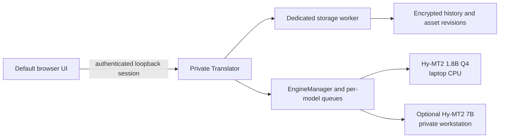

# Private Translator Architecture v1

Date: 2026-07-13

## Product decision

The user interface runs in the user's default browser. A small local executable owns the translation engine and encrypted vault. The product does not run a large model directly inside the browser and does not bundle an entire Chromium runtime.



## One codebase, two profiles

### Lite profile

- Prioritizes everyday office laptops.
- Shows one verified model.
- Automatically uses at most eight logical CPU threads.
- Keeps the model file separate from application updates.

### Quality profile

- Uses the same browser interface and local encrypted vault.
- Starts with the same separately installed and verified 1.8B model.
- Adds an optional Hy-MT2 7B endpoint on a permitted private address. To enable it, set `PRIVATE_TRANSLATOR_QUALITY_API_KEY` and give the external server the same value through `llama-server --api-key`. A missing or empty value disables only this model, not the managed 1.8B model.
- Never includes a cloud model or automatic cloud fallback.

Both profiles use the same storage schema and API, so a user can move between them without converting history.

TranslateGemma is intentionally deferred. Its official model requires a dedicated structured chat template with source and target language-code fields. A generic OpenAI-compatible text prompt is not treated as a production adapter.

## Model-driven language capabilities

Each public model descriptor includes `supported_languages`. The interface rebuilds its source and target selectors from the active model's capability list. Hy-MT2 1.8B and 7B currently expose the 38 entries documented by the official model project. A future model adapter must provide its own tested list instead of inheriting Hy-MT2's list accidentally.

Language display names use the browser's `Intl.DisplayNames` in the chosen interface locale, with stable English fallbacks. English interface strings are the default resource and Korean is the second included interface locale.

## Encrypted history vault

History and cache are different assets. Deleting cache or changing a model must not delete user history.

Only the following structural values remain plaintext in SQLite:

- random record IDs;
- timestamps used for sorting;
- favorite and relationship state;
- 12-byte nonces;
- ciphertext.

The encrypted payload contains:

- source and translated text;
- source and target languages;
- model ID and display label;
- Lite or Quality mode;
- device or private-network boundary;
- processing time;
- number and URL preservation warnings.

Record IDs and timestamps are also authenticated as AES-GCM additional data. Moving ciphertext to another row or changing its authenticated timestamp causes decryption to fail.

### Key handling

- Windows: create a random 256-bit key, protect it with DPAPI CurrentUser, flush it to a same-directory staging file, then atomically publish the complete `vault.key` without replacing an existing winner.
- Refuse to generate a replacement key when an existing SQLite database, WAL, SHM, or journal survives without `vault.key`; recovery requires the original protected key.
- Hold an exclusive per-vault instance lock. A second launch reopens the already authenticated browser session instead of racing the vault, listener, or engine.
- macOS/Linux development: derive a key from `TRANSLATOR_VAULT_PASSPHRASE` with Argon2id.
- Never write source or translated text to browser storage, URLs, or application logs.

Search decrypts records in the storage worker and filters them in memory. The browser submits search text in a JSON body rather than a URL, which keeps sensitive terms out of address bars and access logs. This is appropriate for a personal vault and avoids a plaintext search index. A larger-scale encrypted index requires separate measurement and design.

### History versus approved translation memory

- History is an event log produced when saving is enabled.
- An approved translation asset exists only after an explicit user action.
- Editing an asset appends a new encrypted revision instead of overwriting the current row.
- Deleting history does not delete the linked asset; deleting an asset is a separate explicit action.
- A dedicated storage thread serializes SQLite work so async HTTP handlers are not blocked by database operations.
- `PRAGMA user_version` migrations preserve existing records.

## Local API

```text
GET    /api/config
GET    /api/health
POST   /api/translate
GET    /api/history
POST   /api/history/search
GET    /api/history/:id
PATCH  /api/history/:id/favorite
DELETE /api/history/:id
POST   /api/history/:id/approve
GET    /api/memory
GET    /api/memory/:id
PUT    /api/memory/:id
DELETE /api/memory/:id
GET    /api/memory/:id/revisions
```

The primary process creates a random 256-bit session token. The browser receives it only in a URL fragment, copies it into tab-scoped `sessionStorage`, and immediately removes the fragment. Every API request sends the token in its Authorization header with ambient credentials disabled. `sessionStorage` is isolated by the complete origin, including the loopback port, so an unrelated service on another localhost port cannot receive the token as it could with a host-scoped cookie. Requests must also use the exact bound Host and, when present, the exact same Origin. This blocks unrelated web pages and local processes from treating a bare loopback port as an unauthenticated API.

Responses use `Cache-Control: no-store`, a restrictive Content Security Policy, and `Referrer-Policy: no-referrer`. The server does not enable CORS. API failures include stable language-neutral codes plus an English fallback message; the browser localizes known codes. `/api/config` probes every real configured model and exposes an `available` flag so the interface disables missing or mismatched engines rather than advertising them as ready.

## Translation behavior

- Paste triggers translation automatically.
- Typed input uses `Ctrl+Enter` or the Translate button.
- History saving is enabled by default and can be disabled per request.
- Number and URL differences appear as localized QA warnings.
- Long documents are split near semantic boundaries using the model's real or conservative token budget.
- A chunk that reaches the output limit is split again and retried; QA runs on the full reconstructed result.
- HTTP-compatible and test engines share a backend interface.
- Each model executes one request at a time while other work waits in its queue.
- A newer request from the same browser tab supersedes older work at safe cancellation points.
- Engine errors never include source text in logs or public API responses.
- A successful translation remains visible if encrypted history saving fails, with a separate storage warning.
- An unsaved result is protected by discard and window-close confirmation. Failed replacement requests preserve the previous result and label it explicitly when it no longer matches the current source or settings.

## Packaging boundary

The v0.1.2 combined Windows archive is deliberately thin:

```text
PrivateTranslator-v0.1.2-Windows-x64/
├── PrivateTranslator-Lite.exe
├── PrivateTranslator-Quality.exe
├── Install-Model.exe             # same Rust binary; no-argument setup entrypoint
├── runtime/llama.cpp/            # minimized, smoke-tested dependency closure
├── configs/lite.json
├── configs/quality.json
├── supply-chain/                 # CycloneDX SBOM and locked inventories
└── licenses/                     # actual upstream license texts
```

The model is neither embedded in the executable nor included in the v0.1.2 ZIP. An explicit one-time `setup` command downloads an exact official Hugging Face revision into `%LOCALAPPDATA%\PrivateTranslator\models`. Interrupted transfers remain in a `.partial` file and resume with an HTTP Range request. The file becomes active only after its trusted byte length and SHA-256 match. A user may instead install an already downloaded file with `setup --from`, or request a bundle-local copy with `setup --portable`.

This keeps application releases small and lets future app versions reuse the same verified model without touching encrypted history. The v0.1.0 full bundle remains an archival option for air-gapped transfer. Once the v0.1.2 model setup is complete, ordinary translation remains fully offline.

The executable embeds the stable channel, exact upstream revision, official download URL, byte length, and SHA-256 for the model. It also verifies the exact minimized runtime inventory and every runtime file's byte length and SHA-256 from the embedded trust manifest. Runtime paths and optional portable-model paths must remain below the executable directory; the normal shared model must remain below the resolved current-user model directory. Absolute bundle paths and parent-directory escapes are rejected.

The app starts each managed engine on a fresh ephemeral loopback port with a fresh 256-bit Bearer secret, then checks authenticated `/health` and `/v1/models` responses for the expected model identity. It never trusts or reuses an unrelated process left on a predictable port. On Windows, a kill-on-close Job Object owns the model process so force-closing the parent does not leave it running.

Every `private_network` model, including a loopback endpoint, must declare an `api_key_env`. When present, the environment secret is read at launch and sent as Bearer authentication; it is never returned to the browser or serialized back into public configuration. If the variable is missing or empty, availability is false and translation is rejected with `engine_unavailable` before the backend or network is reached. An external Quality server must be started with `llama-server --api-key` using the same secret as `PRIVATE_TRANSLATOR_QUALITY_API_KEY`. A non-loopback private model must additionally use an RFC1918/ULA IP-literal HTTPS endpoint and a certificate with that IP in its SAN chained to an internal CA trusted by Windows.

Public release packaging fails closed unless the Lite, Quality, and Install-Model executables all have valid SHA-256 Authenticode signatures with RFC 3161 timestamps. `Install-Model.exe` begins as a byte-for-byte copy of the same Rust binary and maps an argument-free launch of that exact filename to `setup`; it is not a wrapper script. The package and final-ZIP gates reject CMD, BAT, PowerShell, VBS, and other executable script formats. Unmistakably named unsigned development archives require all three executables to report `NotSigned` and are available only for local validation. The release includes a CycloneDX inventory covering the application, locked Rust dependencies, llama.cpp runtime, and externally installed pinned model, plus the corresponding license materials.

## Deferred work

- An optional MSI/MSIX-style installer beyond the signing-gated portable executables
- RAM and CPU feature detection with low-memory warnings
- Idle model unloading
- Encrypted portable backup and restore
- Local terminology suggestions based only on explicitly approved assets
- A measured, separately packaged 7B quality model
- A dedicated TranslateGemma adapter and evaluation before it becomes selectable
- Automatic application or model updates with signed metadata (manual pinned model setup is implemented)
