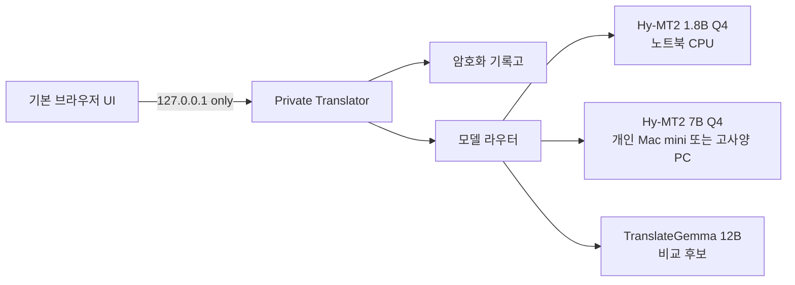

# Private Translator Architecture v1

Date: 2026-07-12

## Product decision

사용자 화면은 브라우저이고, 번역 엔진과 기록고는 작은 로컬 실행 파일이 관리한다. 브라우저 안에서 대형 모델을 직접 실행하거나 Chromium 전체를 프로그램에 포함하지 않는다.



## One codebase, two profiles

### Lite profile

- 일반 사무용 노트북 우선
- 한 개의 검증된 모델만 표시
- CPU 스레드는 논리 코어 수에 맞춰 최대 8개로 제한
- 모델 파일은 애플리케이션과 별도 업데이트

### Quality profile

- 동일한 브라우저 UI와 로컬 기록고 사용
- 빠른 모델, 품질 모델, 비교 모델을 선택 가능
- 개인 네트워크의 Mac mini 모델도 연결 가능
- 클라우드 모델은 기본 목록과 자동 폴백에 포함하지 않음

두 프로필은 저장 스키마와 API가 같으므로 Lite에서 쌓은 기록을 Quality로 그대로 이어서 사용한다.

## Encrypted history vault

기록과 캐시는 별개다. 캐시가 삭제되거나 모델이 바뀌어도 사용자 기록은 남아야 한다.

SQLite에는 다음 열만 평문으로 존재한다.

- 무작위 기록 ID
- 정렬용 생성 시각
- 즐겨찾기 여부
- 12바이트 암호 nonce
- 암호문

암호문 안에는 다음이 함께 들어간다.

- 원문과 번역문
- 원문 언어와 대상 언어
- 모델 ID와 표시 이름
- Lite/Quality 모드
- 장치/개인 네트워크 경계
- 처리 시간
- 숫자 및 URL 보존 QA 경고

레코드 ID와 생성 시각은 AES-GCM의 additional authenticated data로도 사용한다. 다른 행의 암호문을 복사하거나 시각을 바꾸면 복호화가 실패한다.

### Key handling

- Windows: 무작위 256비트 키를 만들고 DPAPI CurrentUser로 감싸 `vault.key`에 저장
- macOS/Linux 서버: `TRANSLATOR_VAULT_PASSPHRASE`에서 Argon2id로 키 파생
- 원문이나 번역문은 브라우저 저장소, URL, 로그에 기록하지 않음

현재 검색은 암호화 레코드를 메모리에서 복호화한 뒤 수행한다. 개인 기록 수천~수만 건을 우선 대상으로 하며, 벤치마크 후 SQLCipher/암호화 검색 색인으로 확장한다.

## Local API

```text
GET    /api/config
GET    /api/health
POST   /api/translate
GET    /api/history
GET    /api/history/:id
PATCH  /api/history/:id/favorite
DELETE /api/history/:id
```

응답에는 `Cache-Control: no-store`, CSP, `Referrer-Policy: no-referrer`를 적용한다. 서버는 loopback Host 헤더만 허용하며 CORS를 열지 않는다.

## Translation behavior

- 붙여넣기 후 자동 번역
- 직접 입력은 `Ctrl+Enter` 또는 번역 버튼
- 기록 저장은 기본 활성화
- 기록 저장을 끄면 해당 요청은 번역만 하고 저장하지 않음
- 숫자와 URL 불일치 시 결과 아래에 QA 경고 표시
- 모델의 실제 입력 토큰 수를 기준으로 긴 문서를 의미 경계에서 분할
- 출력 한도 도달 시 더 작은 구간으로 나누어 재시도하고 전체 결과에 QA 수행
- 모델 오류가 나도 원문을 로그에 포함하지 않음

## Packaging boundary

최종 설치 폴더는 다음 형태를 목표로 한다.

```text
PrivateTranslator-Lite.exe
runtime/llama.cpp/llama-server.exe
models/Hy-MT2-1.8B-Q4_K_M.gguf
configs/lite.json
```

모델을 실행 파일에 넣지 않는다. 애플리케이션 업데이트와 모델 업데이트를 분리하고, 작은 설치판과 완전 오프라인 모델팩을 모두 제공할 수 있어야 한다.

실행 파일은 내장된 신뢰 목록으로 모델과 모든 런타임 EXE/DLL의 크기 및 SHA-256을 확인한다. 패키지 실행 시에는 실행 파일 폴더, 개발 실행 시에는 명시한 `TRANSLATOR_BUNDLE_DIR`만 신뢰하며 절대 경로와 상위 폴더 이탈은 거부한다. 엔진의 `/health` 뒤 `/v1/models`에서 예상 모델 ID까지 일치해야 준비 완료로 본다. Windows에서는 kill-on-close Job Object에 자식 프로세스를 넣어 앱이 강제 종료되어도 모델 엔진이 남지 않게 한다. 이미 사용자가 실행한 엔진도 모델 ID가 일치할 때만 재사용하고 종료 시 건드리지 않는다.

## Deferred work

- RAM 용량과 CPU 명령어 집합 감지 및 저사양 경고
- 유휴 시 모델 언로드
- 암호화된 휴대용 백업/복원
- 개인 용어집과 승인된 번역 메모리
- 다중 사용자 Hub 인증과 사용자별 기록고
- 설치 프로그램 서명 및 자동 업데이트
